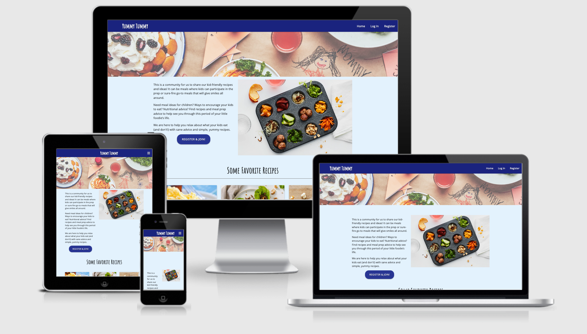

  


# Yummy Tummy Community for Recipe Sharing app

This is Milestone Project for the Back-End Development part of the Full Stack Diploma from Code Institute. This project/repository contains the code for a platform/application to store and share recipes. Users will be able to add, modify, delete recipes, categorise them and do basic searches. This application has mainly been built using technologies as Python and the Flask framework.
This app has been built with materialize css to be fully responsive on all devices and screen sizes. 

## UX

### User Stories
All users have full access to the Home page on the site. A user can see 3 random recipes and an invitation to register an account. 

The user gets a brief About Us which clarifies the sites purpose and the added sense of community of being able to see and share recipes with others. 

A user has full use of basic operations as part of CRUD (Create, Read, Update and Delete) once they sign up and become a member. 

A user can update or delete their own recipes and cook others recipes. 

A search function is available in the All Recipes page. Here a user can search for dish name, ingredients or category. 


### Design
* Wireframes
The website was initially designed using Wireframe.cc to create several wireframes (links below). 
* [Desktop Home](static/wireframes/Desktop_Home.png) 
* [Desktop All recipes](static/wireframes/Desktop_All_recipes.png) 
* [Phone Home](static/wireframes/Phone_Home.png) 
* [Desktop Home](static/wireframes/Phone_All_recipes.png) 


### Typography
I have used 2 Google fonts in designing this Recipe Collection. 'Amatic SC', cursive has been used for headings and "Open Sans", sans-serif has been used for paragraphs. These fonts complement each other very well by the pairings in Google fonts.  


### Colours
* Light blue - is used for backgrounds. 
* Indigo blue - is used for headings and buttons. 
* Black – all typography.


## Features

### Existing Features
* Home page
    * The user is welcomed by an animated banner image and an easy to use Navbar. Under the banner is a short intro about the community. There is a register button, followed by 3 suggested recipes. 
* Register/Login page:
    * Register: If you are new to the community app you are asked to register an account. 
    * Login: If you are logged out you will easily log on by inserting your username and password. Upon login you are whisked off to your profile page. 
* Profile page:
	* Here a user will either find nothing or all of their previously uploaded recipes. 
* All Recepies page:
	* Here a user can see all the recipes that have been uploaded by the community. Your own recipes can be edited or deleted. All others are read and cook only. 
	* Search: by inputting a search for recipe name, ingredient or category will give you requested results. If nothing is found a text will come up with “No results found”
* New Recepies page:
	* This page contains an input text form where a user can add all of their recipes and place them in one of 3 categories:
		* Breakfast
		* Lunch/Dinner
		* Snacks
	* Ingredients list, where the user is asked to separate input with a colon (:). 
	* Prep, where the user is asked to input the steps of the dish, separated with a colon (:). 
	* Image, here the user is asked to input the URL for either their own image or that from an outside website. 
    * Lastly a button to Add your Recipe

### Hidden Features
* Manage Recepies page: Here admin can edit or delete recipes if they don’t conform to the Community’s values or other errors. 
    
### Features Left to Implement
* Pagination for the All Recepies page. 
* Like button. Will add a sense of pride to uploader and for other users to find communality of recipes many like. 
* Buy page: where you can buy utensils, cookbooks and other helpful reference materials. 
* Educational page: Workshops to learn how to cook better and more. Expert panel from Dieticians and chefs. 

## Database Schema
My MongoDB database consists of 3 collections, which are the following:
* Categories
* Recipes
* Users

The recipes collection will contain all information needed for one recipe including category, dish name, ingredients, method to prep and created by. The two other collections will provide options to select when a user is creating a new recipe, to give uniformity to the site.

* Categories:
[Categories](static/readme_img/categories.png)

* Recipes:
[Recipes](static/readme_img/recipes.png)

* Users:
[Users](static/readme_img/users.png)

### Technologies Used
Languages
* 68.3% [HTML5](https://en.wikipedia.org/wiki/HTML5)
* 18.2% [Python](https://en.wikipedia.org/wiki/Python_(programming_language)
* 5.0% [CSS3](https://en.wikipedia.org/wiki/CSS)


Frameworks and Programs
* [JQuery](https://jquery.com/)
    * Used to enable interactive elements of the site.
* [Wireframe.cc](https://wireframe.cc/)
    * Wireframes were created in Wireframe.cc.
* [GitHub](https://github.com/)
    * Used to store and save coded work from Gitpod as repositories. 
* [Gitpod](https://gitpod.io/workspaces/)
    * Used to write out the JQuery, HTML and CSS code in its editor, as well as the README file. It also stored the images for site as well as wireframes. Also used Gitpod for Git add, status, commit and push the code to Github.  
* [Materialize CSS](https://materializecss.com/)
	* Used Materialize all through the project. This UI is easy to navigate and is also the same style as Google uses. 
* [Flask](https://palletsprojects.com/p/flask/) 
	* Used Flask 1.1.2 for developing this project
* [Flask-Pymongo](https://flask-pymongo.readthedocs.io/en/latest/)
    * Used Used Flask_Pymongo 2.3.0 for developing this project
* [Pymongo](https://pypi.org/project/pymongo/)
    * Used Used Pymongo 3.11.3 for developing this project 
* [Jinja](https://palletsprojects.com/p/jinja/)
    * Used Jinja for developing this project 
* [Werkzeug](https://palletsprojects.com/p/werkzeug/)
    * Used Werkzeug 1.0.1 for developing this project
* [Mongo DB](https://www.mongodb.com/)
    * Used Mongo DB for this project
* [Google Fonts](https://fonts.google.com/)
    * Used two complementary fonts for this game. 
* [Font Awesome](https://fontawesome.com/)
	* Used various playful icons for forms and buttons. 
* [Stack Overflow](https://stackoverflow.com/)
    * Used Stack Overflow to provide information on various steps of the build as well as trouble-shooting. 
* [W3 Schools](https://www.w3schools.com/)
    * Used to help with the technicalities of writing good code. 

## Testing

### During the build
Flask uses 'flash' messaging' for messages to appear when the user performs a task (such as adding a recipe or logging out). The following flask messages were tested, as was the underlying function (adding recipe, logging out) to ensure CRUD functions worked properly and the user was able to perform these functions. When a user first views Yummy Tummy website they can only view 3 recipes on the home page. Those recipes can be viewed further by clicking the ‘Try Me’ link and the recipe ingredients and methods shown. To to view the full range of recipes, and be able to add their own recipe (as well as edit and delete), users MUST login or register. The website is correctly routed using Flask (app.py) routing to correctly route users to whichever page they wish to view. User and non-user views were tested across many pages and functions to ensure they worked correctly. In addition, I tested all links to make sure they redirected correctly and worked, such as url for home page and all recipes page. I also tested responsiveness on mobile versions by clicking on links in responsive view. I tested search feature, to make sure the search button functions correctly and it does. I also tested this across mobile versions and works correctly.
Flash messages were shown for the following:
* Registration-if user already exists: "This chef already exists"
* Registration-new user: "Registration Successful!"
* Login: "Welcome, {}".format(request.form.get("username”)))-Welcomes user by name
* Login-wrong username or password or if Username doesn’t exist: "Incorrect Username and/or Password"
* Logout-"You have been logged out"
* New Recipe Added: "Recipe Successfully Added"
* Recipe edited by user or Admin: "Recipe Successfully Updated"
* Recipe deleted by user or Admin: "Recipe Successfully Deleted"
* Recipe search-if no recipe is found: “Ro Results Found”

Dev tools for Chrome and Firefox were used to make sure the layout was responsive for all screen sizes, with mobile first.

### Responsive / Device testing
The following devices were used to test the site:
* 24" Monitor
* 15.6" Laptop Display
* 10" Galaxy Tab 4.0 (Portrait and Landscape)
* 5.8" Samsung S8 (Portrait and Landscape)
* 5.8” iPhone X (Portrait and Landscape)

Once the recipe site was deployed, it was tested on multiple devices and feedback was also requested from friends and co-workers.  

### Version Control (GitHub)
I used version control (GitHub) on an ongoing basis to back-up my code to a remote repository at regular intervals throughout development of the website project.

### Code Validation
* [W3 HTML validator](https://validator.w3.org/#validate_by_input)
    * All HTML code was checked and any errors found were fixed.
* [W3 CSS validator (jigsaw)](https://jigsaw.w3.org/css-validator/#validate_by_input)
    * CSS code was checked and no errors were found.
* [JSLint](https://jslint.com/)
    * All JavaScript/JQuery code was checked to ensure all code complies with ES6 standards.

## Deployment

### Requirements
* [Mongo DB](https://www.mongodb.com/)
* [Python](https://www.python.org/)-
* [PIP](https://pypi.org/project/pip/)-For installing packages in Python
* [Git](https://git-scm.com/downloads)-Version control
* [Gitpod](https://gitpod.io/workspaces/)-The IDE I used, others are available
* [Heroku](https://devcenter.heroku.com/)

## Steps for Cloning Locally
1. Go to the project repository [Yummy Tummy](https://github.com/monanorremo/yummy-tummy)

1. Open Git and select clone from the repository tab. Enter source location [Yummy Tummy](https://github.com/monanorremo/yummy-tummy) and the location you wish to store the files and press the clone button

1. Open your IDE and navigate to the directory where you stored the cloned files

1. Install requirements from requirements.txt file by entering pip3 install -r requirements.txt in the terminal

1. Activate your virtual environment by py -m venv virtual into the terminal

1. Create an environment file env.py to store environment variables. Add environment variables as shown:

os.environ.setdefault("IP", "0.0.0.0")
os.environ.setdefault("PORT", "5000")
os.environ.setdefault("SECRET_KEY", "ADD_YOUR_SECRET_KEY")
os.environ.setdefault("MONGO_URI", "YOUR_MONGODB_URI")
os.environ.setdefault("MONGO_DBNAME", "YOUR_MONGO_DBNAME")```

* Remember to update your **Secret Key**, **Database Name** and **Database URI**

1. Add `env.py` to a `.gitignore` file so sensitive data will not be pushed to GIT

1.  You should now be able to run the program by entering `python3 app.py` into the terminal

### Deploying to Heroku
1. Login to [Heroku](https://dashboard.heroku.com/)

1.  Go to `Create new App` from `New` tab

1.  Go to settings

1.  Click on `Reveal Config Vars` to add environment variables to match env.py file

1.  Click on `Deploy` tab and set to automatically deploy from GitHub by entering the repository name [Yummy Tummy](https://github.com/monanorremo/yummy-tummy) 

1.  Click on connect

1.  In your IDE create the requirements.txt file to contain all dependencies

` pip3 freeze --local > requirements.txt`

1.  Create the Procfile

`echo web: python app.py > Procfile`

1.  Make sure all files have been pushed to GitHub repository 

1.  In Heroku in the `Deploy` tab scroll down to `Manual deploy` and click `Deploy Branch`

1.  When Heroku is finished building the app you can press the `View` button to view your deployed app


## Credits

### Content
The content contained in the project is mainly my own and anywhere I've used any outside references, I've made reference to them (as in this README document). I've carefully referenced all sources of code and websites referred to, as well as my own research.
Recipes for database:
* [Kidspot](https://www.kidspot.com.au/kitchen/)

* [Yummy Toddler Food](https://www.yummytoddlerfood.com/recipe-index/)


### Media
The hero-image of a table with paper tablecloth with kid drawings I found on [https://www.epicurious.com/expert-advice/kids-cooking-ideas-homeschooling-article](https://www.epicurious.com/expert-advice/kids-cooking-ideas-homeschooling-article). Photo by Chelsea Kyle. 
The index image with the muffin-pan filled with veggies etc I found at [https://www.epicurious.com/expert-advice/the-power-of-the-pu-pu-platter-article](https://www.epicurious.com/expert-advice/the-power-of-the-pu-pu-platter-article). Photo by Chelsea Kyle, Food Styling by Simon Andrews, Prop Styling by Beatrice Chastka
 
### Code
*   I based the project on code I learned throughout the course from the tutorials of Code Institute Mini-project and by referring to the lessons in the module. I also referred to W3Schools and also on occasion I referred to Stack Overflow.


## Acknowledgements
I would like to thank my patient children for letting me work on my milestone project. Also the Slack community for CI, the terrific tutors at CI tutor support. And last but definately not least, Youtube and StackOverflow.

